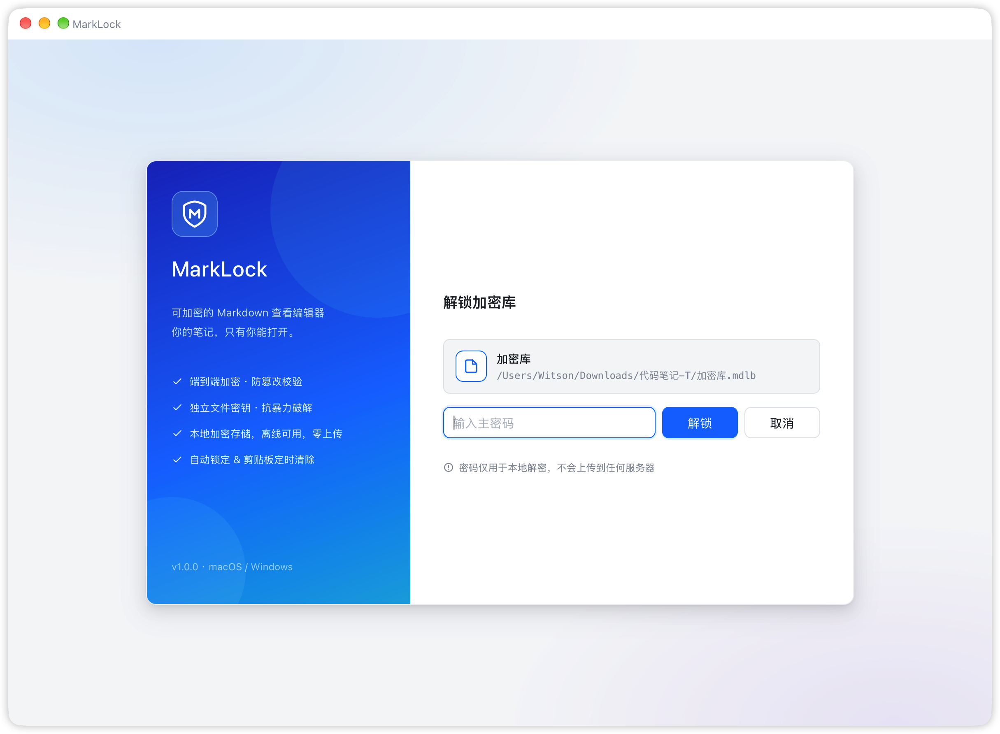
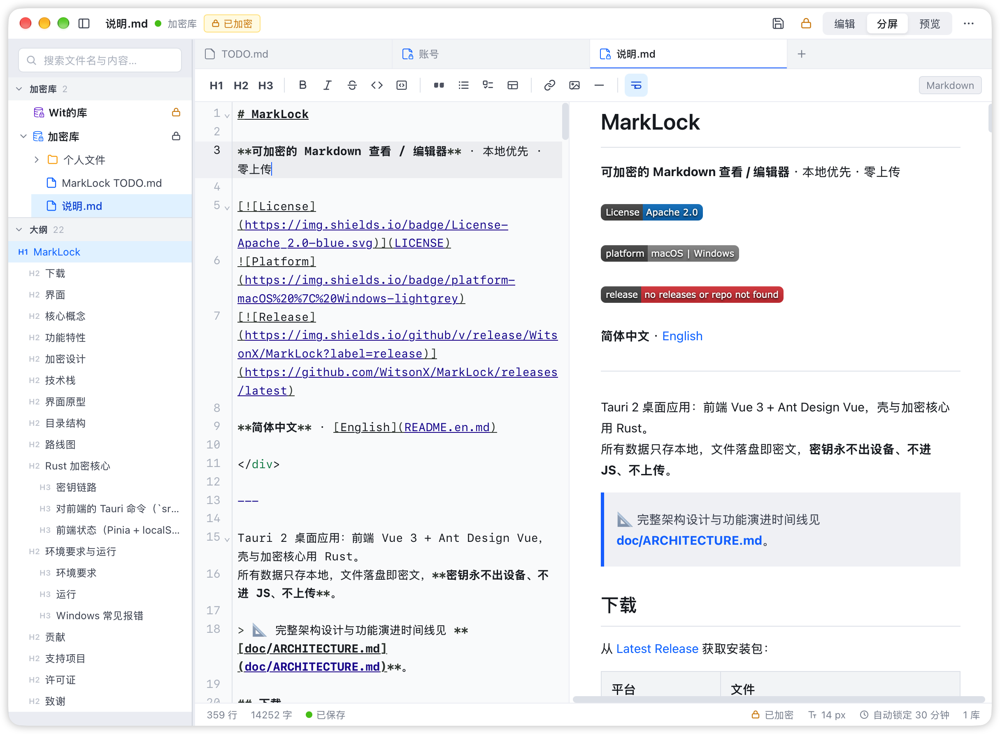
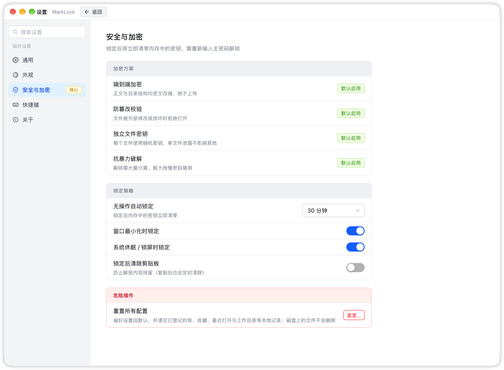

<div align="center">

# MarkLock

**可加密的 Markdown 查看 / 编辑器** · 本地优先 · 零上传

[](LICENSE)

[](https://github.com/WitsonX/MarkLock/releases/latest)

**简体中文** · [English](README.en.md)

</div>

---

Tauri 2 桌面应用：前端 Vue 3 + Ant Design Vue，壳与加密核心用 Rust。
所有数据只存本地，文件落盘即密文，**密钥永不出设备、不进 JS、不上传**。

> 📐 完整架构设计与功能演进时间线见 **[doc/ARCHITECTURE.md](doc/ARCHITECTURE.md)**。

## 下载

从 [Latest Release](https://github.com/WitsonX/MarkLock/releases/latest) 获取安装包：

| 平台 | 文件 |
|---|---|
| macOS（Apple Silicon / Intel） | `MarkLock_<ver>_aarch64.dmg` / `MarkLock_<ver>_x64.dmg` |
| Windows（x64） | `MarkLock_<ver>_x64-setup.exe` |

> 安装包只做 ad-hoc 本地签名、未走 Apple 公证，首次打开会被 Gatekeeper 拦下并提示「无法验证开发者」。任选一种放行：
> - 在「应用程序」里**右键 MarkLock.app →「打开」**，弹窗中再点「打开」；
> - 或到「系统设置 → 隐私与安全性」底部点「仍要打开」。
>
> 万一仍提示「已损坏」，执行 `xattr -dr com.apple.quarantine /Applications/MarkLock.app` 清除隔离属性即可。
> Windows 同样未签名，安装时在 SmartScreen 提示里点「更多信息 → 仍要运行」。

## 界面

> 静态高保真原型可在浏览器直接打开预览：[`doc/ui-prototype/index.html`](doc/ui-prototype/index.html)

| 启动与解锁 | 主编辑器 | 设置 |
|---|---|---|
|  |  |  |

## 核心概念

| 概念 | 说明 |
|---|---|
| 加密库 `.mdlb` | 一个**单文件容器**（MarkLock Bundle），内部是一棵加密的文件树——文件名、目录结构、正文全部密文，磁盘上只有一个不透明的 `.mdlb` 文件，可整体放进 iCloud / Dropbox / 移动硬盘同步 |
| 加密文件 `.mdl` | 单个加密的 Markdown 文件（MarkDown Lock），也可独立存在（如桌面上的「投资记录.mdl」） |
| 主密码 | 只存在于用户脑中，经 Argon2id 派生出 KEK，不落盘、不上传 |
| DEK | 库/文件的随机数据密钥，由 KEK 包裹后存于文件头；单文件库全库共享一个 DEK，`.mdl` 单文件独立 DEK；改主密码只需重包裹 DEK，无需全文重加密 |

## 功能特性

- 加密库：新建 / 打开 / 最近列表 / 密码提示 / 失败次数限制；**库是单文件（.mdlb），内部支持文件夹**（任意层级嵌套），解锁一次后库内文件读写均复用库主密码、无需再次输入；文件名与目录结构全部密文
- 编辑：Markdown 源码编辑（语法高亮）、编辑 / 分屏 / 预览三种模式、格式化工具栏、自动保存（800ms 防抖加密落盘）
- 新建：页签栏「+」直接开一个未落盘的空白草稿页签，保存时才选目标——存为独立加密文件 `.mdl`（选路径 + 填密码），或存入已解锁的加密库（可选目标文件夹，复用库主密码，无需再填密码）；密码只需 1 位以上即可，输入时下方实时显示强度条（弱/中/强）供参考
- 右上角菜单：新增「新建文件」「新建加密库」入口；当前页签不在库内时额外显示「复制到加密库」（把当前文件内容另存一份到已解锁库，原文件不变）；保存/复制时选目标库，目标库下拉里含「＋ 新建库…」选项，选中后在下方就地展开库名/保存位置/主密码/确认密码表单，创建成功后自动选中新库继续保存
- 工作区：同时打开多个加密库（单文件 .mdlb）/ 单个加密文件（.mdl）；VSCode 式侧边栏（打开的文件、打开的库（有才显示）、收藏（有收藏才显示）、最近打开、工作目录；其中「打开的文件」与「最近打开」默认不显示，可在「设置 → 侧边栏分组」或侧边栏分组菜单开启）；「打开的库」解锁后以递归文件夹树浏览内容，文件夹可展开/折叠，悬停可新建文件/文件夹/重命名/移动/删除；单文件 `.mdl` 不是库，打开时新开一个页签、内容区居中显示密码框，输入密码解锁后才解密显示；工作目录是操作系统目录视图，普通文件夹可展开，但目录里的库（.mdlb）是原子节点不展开，`.mdl` 显示为「加密文件」节点；**库锁定后，已打开的库内文件页签标题显示为「xx 库文件」（不暴露具体文件名），收藏/最近打开里的库内文件同样隐藏真实文件名**，重新解锁后恢复原名与内容；多文件切换支持顶部页签或左侧列表，可在设置中选择
- 外部修改监控：打开的文件被其它程序改写时及时重新加载（默认每 2s 比对一次磁盘 mtime/大小，并在窗口重新获得焦点时立刻检查）：页签无未保存修改 → 直接换成磁盘上的新内容并提示；有未保存修改 → 不顶掉你的编辑，页签挂橙色角标，可在页签右键 / 点状态栏提示「重新加载」取磁盘版本（会先确认丢弃）；文件在磁盘上被删除或移动时挂红色角标提醒，页签内容保留；可在「设置 → 通用 → 打开的文件 → 监控外部修改」关闭（.mdlb 库内文件按整个容器监控，只重读已打开的那几个文件）
- 工作目录增减监控：侧边栏工作目录树按同样的轮询节奏（2s，并在窗口重新获得焦点/回到前台时立即检查）比对已挂载根目录与已列过内容的子目录的条目构成，别的程序往目录里新增/删除/重命名文件或文件夹时自动刷新（只看条目增减，不看文件内容；保留已展开的层级不被收起，刷新失败静默重试不弹窗），不受上面开关控制
- 收藏：可收藏库，也可收藏库内文件（库行、侧边栏条目的星标，或页签/库/收藏条目的右键菜单「收藏 / 取消收藏」）；点击收藏的库内文件时，若库未解锁会先跳转解锁该库，解锁成功后自动加载并打开该文件
- 浏览：文件树、全文搜索（解密在内存中进行）、大纲、历史快照（可选，同样密文存储）
- 安全：无操作自动锁定（默认 5 分钟）、锁屏/休眠锁定、锁定时密钥内存清零、剪贴板 60s 自动清除
- 其他：修改主密码、更换加密方案并全文重加密、明文导出（危险操作，二次确认）

## 加密设计

详见下方「Rust 加密核心」一节。

**库 = 单文件容器模型**：加密库（`.mdlb`）是一个**单文件**，文件头存 KDF 参数与「全库共享 DEK」的 wrapped_dek，
数据区是整棵文件树（文件名 + 目录结构 + 正文）的 JSON 序列化密文。磁盘上只有一个不透明 blob，连文件名、目录名都不可见。
单个 `.mdl` 文件也可独立存在（文件头自带 KDF 参数与 wrapped_dek，独立密码）。

```
┌─ 单文件库（.mdlb）───────────────────────┐
│ 头（明文 JSON）                          │
│   format : "mlk-vault/1"                │
│   kdf    : argon2id, m=64MB, t=3, p=4, salt │
│   wrapped_dek : KEK 包裹的全库 DEK       │
│ 数据区（密文，AES-256-GCM）              │
│   nonce + ct = JSON(文件树)             │
│     ├─ 笔记/第一篇.md   "正文..."        │
│     ├─ 项目/方案.md     "正文..."        │
│     └─ ...                              │
└──────────────────────────────────────────┘
```

- 算法：AES-256-GCM（认证加密，防篡改）+ Argon2id（抗 GPU 暴力破解）
- 实现：Rust 侧 `aes-gcm` + `argon2` crate，前端只接触明文视图与密文字节，密钥不经过 JS
- 解锁流程：主密码 + salt → Argon2id → KEK → 解开全库 DEK → 解密整棵文件树到内存；全程 < 300ms（个人笔记体量）
- 写入：解锁后改任一文件，整棵树重新加密、整体重写 `.mdlb` 文件（个人笔记体量无感）
- 改主密码：只重包裹全库 DEK，不重加密正文
- 单文件库（.mdlb）与单文件（.mdl）在磁盘上都用 `[4字节头长度 + 头JSON][nonce][ct]` 布局，靠 `format` 字段区分（`mlk-vault/1` vs `mlk/1`）

## 技术栈

| 层 | 选型 | 理由 |
|---|---|---|
| 壳 | Tauri 2 | 体积小（对比 Electron）、系统 WebView、Rust 原生能力做加密 |
| 前端 | Vue 3 + Vite + TypeScript | Options API 组件，生态成熟 |
| 组件库 | Ant Design Vue | 桌面工具型 UI 匹配度高，原型视觉已对齐其默认主题 |
| 编辑器 | CodeMirror 6 | Markdown 语法高亮 + 源码模式 + 搜索/折叠/自动补全，已接入替换 textarea（见 `src/components/CodeMirrorEditor.vue`） |
| 加密 | Rust：`aes-gcm` / `argon2` | 密钥操作全部在 Rust 侧完成 |

## 界面原型

`doc/ui-prototype/` 下是纯静态高保真原型（无外部依赖，双击即可看）：

```
doc/ui-prototype/
├── index.html            # 原型导航 + 内嵌预览（入口）
├── assets/base.css       # 共享基础样式（AntD 视觉基调）
└── screens/
    ├── unlock.html       # 01 启动与解锁
    ├── editor.html       # 02 主编辑界面（VSCode 式工作区：
                          #    打开的文件/打开的库/收藏/最近打开/工作目录；
                          #    库锁定时所属页签变锁定占位，保留工作集；
                          #    顶部页签或左侧列表两种切换方式，可设置）
    ├── settings.html     # 03 设置（安全与加密为核心页）
    └── dialogs.html      # 04 弹窗集合（新建库/解锁错误态/改主密码）
```

浏览器打开 `doc/ui-prototype/index.html`，左侧切换四个界面。原型即后续 Vue 组件拆分的视觉基准。

## 目录结构

```
MarkLock/
├── package.json            # Vue/Vite/AntD/CodeMirror 依赖 + tauri 脚本
├── vite.config.ts          # Vite 配置（产物输出 dist，对齐 tauri frontendDist）
├── index.html              # SPA 入口
├── tsconfig.json
├── scripts/                # 图标生成脚本（gen-filetype-icons / gen-win-appicon）
├── src/                    # Vue 3 前端工程（Options API，未用 <script setup>）
│   ├── main.ts             # 入口：挂载 Vue + AntD + 路由 + 全局指令 v-tip + 主题/平台检测
│   ├── App.vue
│   ├── router/index.ts     # 四屏路由（unlock/editor/settings/dialogs，hash 模式）
│   ├── styles/global.css   # 全局样式（CSS 变量，迁移自原型 base.css）
│   ├── components/
│   │   ├── TitleBar.vue          # macOS 标题栏（红绿灯 + 标题）
│   │   ├── CodeMirrorEditor.vue  # CodeMirror 6 编辑器封装（每文件常驻实例）
│   │   ├── EncIcon.vue           # 加密库/加密文件/普通文件图标（currentColor 主题跟随）
│   │   └── VaultTreeNode.vue     # 库内递归文件树节点
│   ├── stores/vault.ts           # Pinia store（解锁会话/打开文件/收藏/最近/设置，localStorage 持久化）
│   ├── lib/
│   │   ├── tauri.ts              # Rust 命令桥接层（invoke + 文件对话框封装）
│   │   ├── filewatch.ts          # 外部修改轮询监控（模块级单例）
│   │   ├── splash.ts             # 启动加载态
│   │   └── tooltip.ts            # 全局 tooltip（v-tip 指令）
│   └── views/
│       ├── UnlockView.vue   # 01 启动与解锁
│       ├── EditorView.vue   # 02 主编辑界面
│       ├── SettingsView.vue # 03 设置
│       └── DialogsView.vue  # 04 弹窗集合（AntD Modal）
├── src-tauri/              # Tauri 壳 + Rust 加密核心
│   ├── icons/              # 图标（app-icon*.svg 源 + filetypes/ 生成物 .ico/.icns）
│   ├── tauri.conf.json
│   └── src/
│       ├── lib.rs          # 窗口/托盘/原生菜单 + crypto 命令注册
│       ├── main.rs
│       ├── assets.rs       # 资源/文件关联相关
│       ├── clipboard.rs    # 剪贴板读写（含 60s 自动清除）
│       └── crypto/         # 加密核心
│           ├── mod.rs      #   子模块聚合导出
│           ├── error.rs    #   统一错误类型（Serialize 为可读消息）
│           ├── format.rs   #   .mdl / .mdlb 文件格式常量与头/体结构
│           ├── keys.rs     #   KEK 派生 + DEK 包裹/解包裹/重包裹
│           ├── file.rs     #   .mdl 序列化/反序列化
│           ├── session.rs  #   解锁会话 + 自动锁定计时（SessionStore）
│           └── vault.rs    #   库级操作（创建/解锁/读写/改密码/锁定/搜索）
├── doc/                    # 项目文档
│   ├── ui-prototype/       # 界面原型（视觉基准）
│   └── ARCHITECTURE.md     # 架构与演进文档
├── README.md               # 本文件
└── LICENSE                 # Apache-2.0
```

## 路线图

1.0 已覆盖加密库 / 单文件双形态、CodeMirror 编辑器、全文搜索、收藏、大纲、外部修改监控与打包分发。

后续计划：

- [ ] 历史快照（可选，同样密文存储）
- [ ] 更换加密方案并全文重加密

需求与建议欢迎提到 [Issues](https://github.com/WitsonX/MarkLock/issues)。

## Rust 加密核心

### 密钥链路

```
主密码 + salt ──Argon2id──▶ KEK（32B，内存清零）
                                │  AES-256-GCM
                                ▼
                        wrapped_dek ──▶ DEK（32B，每文件独立随机）
                                │  AES-256-GCM
                                ▼
                         markdown 源码（密文）
```

- **KEK**：主密码经 Argon2id（m=64MiB / t=3 / p=4）派生，`Zeroize` 保证 drop 时清零
- **DEK**：每文件独立随机 32 字节，由 KEK 用 AES-256-GCM 包裹后存文件头
- **改主密码**：只重包裹 DEK（`rewrap`），不重加密正文

### 对前端的 Tauri 命令（`src/lib/tauri.ts` 已封装）

| 命令 | 说明 |
|---|---|
| `unlock_file_vault(vaultId, path, password, autoLockSecs?)` | 解锁单文件库（.mdlb，解密出整棵文件树） |
| `create_file_vault(path, password, hint?)` | 新建单文件库（.mdlb） |
| `list_file_vault(vaultId, path)` | 列已解锁单文件库的递归树（不含内容） |
| `read_file_vault(vaultId, path, rel)` / `write_file_vault(...)` | 读/写单文件库内文件正文 |
| `create_in_file_vault(vaultId, path, rel, content)` | 单文件库内新建文件 |
| `create_folder_in_file_vault(vaultId, path, rel)` | 单文件库内新建文件夹 |
| `delete_in_file_vault(vaultId, path, rel)` | 删除单文件库内文件/文件夹 |
| `rename_in_file_vault(vaultId, path, old, new)` | 重命名/移动单文件库内文件/文件夹 |
| `change_file_vault_password(vaultId, path, old, new)` | 改单文件库主密码（重包裹全库 DEK） |
| `unlock_vault(vaultId, dir, password, autoLockSecs?)` | 解锁目录库（旧模型，保留兼容） |
| `create_vault(dir, password, hint?)` | 新建目录库（旧模型，保留兼容） |
| `list_dir(dir)` | 列目录一层（工作目录视图） |
| `list_vault(vaultId, dir)` | 列已解锁目录库的递归树 |
| `create_in_vault(vaultId, relPath, content)` | 目录库内新建加密文件 |
| `create_folder_in_vault(vaultId, relPath)` | 目录库内新建空文件夹 |
| `delete_in_vault` / `rename_in_vault` | 目录库内删除 / 重命名移动 |
| `unlock(vaultId, path, password, autoLockSecs?)` | 解锁单 `.mdl` 文件 |
| `lock(vaultId)` / `lock_all` | 锁定单个/全部（内存密钥清零） |
| `read_file(vaultId, path)` / `write_file(vaultId, path, content)` | 单文件 .mdl 读/写 |
| `create_file(path, password, content, hint?)` | 新建单加密文件 |
| `change_password(vaultId, path, old, new)` | 改单文件 .mdl 主密码 |
| `unlocked_count` / `reap_expired` | 状态查询 / 回收过期会话 |

前端另封装 `openFileDialog` / `openDirDialog` / `saveFileDialog` / `saveFileVaultDialog`（走 `tauri-plugin-dialog`）。

> 自动锁定计时由 Rust 侧 `SessionStore` 维护：每次读写刷新活动时间戳，
> 超时（默认 5 分钟，可在设置调整）`reap_expired` 会清零对应密钥；窗口关闭时 `lock_all`。
> 前端 `EditorView` 每 30 秒调用一次 `reap_expired` 回收过期会话，锁定的库页签变占位。

### 前端状态（Pinia + localStorage）

`src/stores/vault.ts` 统一管理：最近/已登记库列表（含锁定状态）、打开的文件页签、
当前激活文件、设置项。全部持久化到 localStorage（`marklock.recent` / `marklock.settings`），
密钥与明文一律不进 store，只存库路径/名称/锁定态等元信息。

## 环境要求与运行

### 环境要求

| | macOS | Windows |
|---|---|---|
| Rust | rustup(stable) | rustup-init.exe(stable, MSVC) |
| 编译器配套 | Xcode Command Line Tools | Visual Studio Build Tools，装「使用 C++ 的桌面开发」工作负载 |
| Node | 18+（实测 v22 可用） | 18+ |
| WebView | 系统自带 WKWebView | WebView2 Runtime（Win11 / 较新 Win10 已内置，老 Win10 需装 Evergreen 离线包） |

Windows 上 Rust 和 Build Tools 缺一不可：rustup 只给编译器，链接器 `link.exe` 来自 Build Tools。

**Windows 全新机器安装顺序**（装完每一项都重开终端）：

1. VS Build Tools — https://visualstudio.microsoft.com/zh-hans/downloads/ （「所有下载」→「Visual Studio 生成工具」）。安装器里只勾**「使用 C++ 的桌面开发」**一个工作负载
2. Rust — https://rustup.rs/ 下载 `rustup-init.exe`，一路默认
3. Node — https://nodejs.org/ LTS 版
4. WebView2 Runtime — 老 Win10 从 https://developer.microsoft.com/microsoft-edge/webview2/ 下 Evergreen 独立安装包

验证：`where.exe cargo`、`where.exe link`、`node -v` 都有输出才算齐（PowerShell 里别用 `where`，是 `Where-Object` 别名会静默无输出）。

**Windows 跑在 Apple 芯片虚拟机上时（ARM64 Windows，如 Parallels/VMware）**：rustup 默认装 aarch64 宿主工具链，而 Build Tools 默认只勾 x64/x86 MSVC 工具，错配会报 `link.exe not found` 或链接 `mainCRTStartup 无法解析`。`--target` 救不了这个错配，必须把 Rust 宿主工具链整体切到 x86_64：

```bash
rustup toolchain install --force-non-host stable-x86_64-pc-windows-msvc
rustup default --force-non-host stable-x86_64-pc-windows-msvc
rustc -vV        # 确认 host: x86_64-pc-windows-msvc
```

两条命令都必须带 `--force-non-host`（ARM64 Windows 有 x64 模拟层，实际能跑）。

### 运行

```bash
npm ci             # 按 package-lock.json 安装（推荐，保证依赖版本一致）
npm install        # 或普通安装；改动依赖后请一并提交 lock 文件
npm run dev        # 启动 Vite dev server（http://localhost:1420），仅前端
npm run build      # 构建前端产物到 dist/
npm run dev:tauri  # 前端 + Tauri 壳一起跑（需 Rust 环境）
```

首次编译约 400 个 crate，mac 几分钟、Windows 十几分钟，属正常；之后增量编译是秒级。

Windows 上**每次新开终端**都要先注入 MSVC 环境，否则链接失败；最省事是固定用开始菜单的「Developer Command Prompt for VS」当编译终端。macOS 无此要求。

Rust 加密核心测试（在 `src-tauri/` 下）：

```bash
cargo test --lib   # 单元测试：密钥往返、错误密码、篡改检测、改密码重包裹、目录库全流程、库内文件夹、单文件库全流程（增删改移+改密码+磁盘单文件）、路径穿越防护、明文目录搜索等
cargo check        # 编译检查
```

### Windows 常见报错

**`failed to run 'cargo metadata' ... program not found`** — cargo 不在 PATH。用 `where.exe cargo` 或 `Get-Command cargo` 验证；没输出就是没装 Rust，有输出就重开终端再试。

**`linker link.exe not found` 或链接报 `mainCRTStartup 无法解析`** — 前者是 cargo 没探测到 MSVC，后者是链接器架构和编译目标错配（ARM64 Windows 上用了 x64 环境，或反之）。统一解法：编译终端里先注入 MSVC 环境再编译：

```cmd
call "C:\Program Files (x86)\Microsoft Visual Studio\18\BuildTools\VC\Auxiliary\Build\vcvars64.bat"
```

路径以本机实际安装为准（`dir /s /b "C:\Program Files (x86)\Microsoft Visual Studio\*vcvars64.bat"` 定位）。ARM64 Windows 上还需把 Rust 宿主工具链切到 x86_64（见上）。

**`failed to run ...\WixTools314\light.exe`（Windows 打包 MSI）** — WiX 3 是老 ANSI 工具，项目路径含中文或 `productName` 为中文会挂。绕过：`npm run build -- --bundles nsis` 只打 NSIS 安装器；或项目挪到纯 ASCII 路径 + `productName` 改 ASCII。裸 exe 此时其实已编译成功，在 `target/release/` 下可直接用。

**`error messaging the mach port for IMKCFRunLoopWakeUpReliable`（macOS 日志）** — macOS 输入法框架的无害噪音，Safari/Electron 应用也有，忽略。

**项目目录 3G 多** — `src-tauri/target/` 是编译产物（debug 不优化且带调试符号），不是下载的文件，`cargo clean` 可回收。真正下载的 crate 源码在 `~/.cargo/registry`，不在本目录。

**从 mac 拷贝项目到 Windows 后报错** — 删掉拷来的 `src-tauri/target/`（mac 产物，无用）和 `node_modules/`（`@tauri-apps/cli` 是平台相关原生二进制），重新 `npm install`。

前端四屏路由（hash 模式）：

| 路由 | 页面 |
|---|---|
| `#/unlock` | 01 启动与解锁 |
| `#/editor` | 02 主编辑界面 |
| `#/settings` | 03 设置 |
| `#/dialogs` | 04 弹窗集合 |

## 贡献

欢迎提 Issue 与 PR。较大改动建议先开 Issue 讨论方向。

- 开发环境与运行方式见上文「环境要求与运行」
- 架构约束与扩展点见 [doc/ARCHITECTURE.md](doc/ARCHITECTURE.md)
- 前端组件统一使用 **Options API**（不使用 `<script setup>` / Composition API）
- 提交前请跑 `cargo test --lib`（在 `src-tauri/` 下）确认加密核心无回归

## 支持项目

MarkLock 免费且开源。如果它帮到了你：

- ⭐ Star 本仓库，让更多人发现它
- 🐛 提 Issue 反馈问题或建议功能
- ☕ 打赏支持作者持续维护

<!-- 捐赠二维码放入 doc/donate/ 后取消下方注释，占位说明见 doc/assets/README.md
| 微信赞赏 | 支付宝 |
|---|---|
|  |  |
-->

## 许可证

[Apache License 2.0](LICENSE)

## 致谢

- [Tauri](https://tauri.app/) — 轻量且安全的桌面壳
- [Vue](https://vuejs.org/) · [Ant Design Vue](https://antdv.com/) — 前端与组件
- [CodeMirror](https://codemirror.net/) — Markdown 编辑器
- [aes-gcm](https://github.com/RustCrypto/AEADs) · [argon2](https://github.com/RustCrypto/password-hashes) · [zeroize](https://github.com/RustCrypto/traits/tree/master/zeroize) — 加密原语与内存清零
